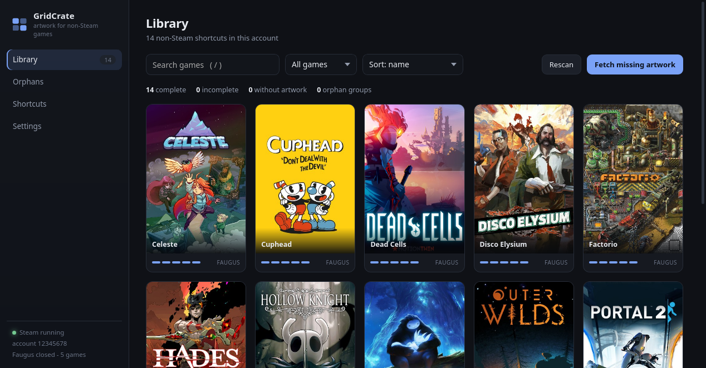
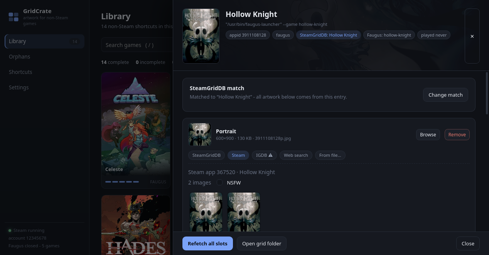

# GridCrate

**Artwork manager for non-Steam games in Steam.** A modern replacement for BoilR: a
browser-grade UI, four artwork sources, bulk fetching — and the orphaned-artwork repair
that other tools don't do.





## Why

When you add a non-Steam game (Faugus Launcher, Heroic, Lutris, plain Wine, a native
binary…), Steam stores the shortcut in `shortcuts.vdf` and looks up its artwork in
`userdata/<account>/config/grid/` by an appid that is *derived from the executable and the
game name*:

```
appid = crc32(Exe + AppName) | 0x80000000
```

Every time that shortcut is rewritten — which Faugus and Heroic do whenever you edit the
game — the appid changes. The artwork stays behind under the old id, and the game shows up
blank in your library. GridCrate keeps the appid history of every game, detects the orphan
groups and re-links the artwork automatically.

## Features

- **Library view** of every non-Steam shortcut, with per-slot status (portrait, wide, hero,
  logo, icon), filters and search.
- **Four artwork sources**, chosen per slot: SteamGridDB, official Steam CDN art, IGDB and
  web image search — plus drag & drop, `Ctrl+V` paste and file upload for anything else.
- **Live preview** of every candidate at full size, with real dimensions, before applying.
- **Bulk fetch** with progress, safe matching and a "prefer official Steam art" option.
- **Orphan repair**: finds artwork whose appid no longer belongs to any shortcut, identifies
  the game it belongs to (local appid history, BoilR's cache, or perceptual image hashing)
  and re-links it.
- **Shortcut editing**: add, rename, edit or remove shortcuts — including "Add from Faugus",
  which writes exactly the shortcut Faugus would (same appid, so the artwork lines up).
- **Faugus Launcher integration**: mirrors covers/banners/icons into Faugus' own folders
  (460×690, 1920×620, 256px) and stores the SteamGridDB id in `games.json`.
- **Safe writes**: `shortcuts.vdf` is backed up before every change (last 10 kept), written
  atomically, and never touched while Steam is running (Steam rewrites it from memory on
  exit). Removed artwork goes to a trash folder instead of being deleted.
- **Zero build step**: Python + GTK/WebKitGTK, no Node, no Rust, no Electron.

## Requirements

- Linux with GTK 3 and WebKitGTK 4.1
- Python 3.10+
- `PyGObject`, `Pillow`, `requests`

```bash
# Arch / CachyOS
sudo pacman -S python-gobject gtk3 webkit2gtk-4.1 python-pillow python-requests

# Debian / Ubuntu
sudo apt install python3-gi gir1.2-webkit2-4.1 python3-pil python3-requests

# Fedora
sudo dnf install python3-gobject gtk3 webkit2gtk4.1 python3-pillow python3-requests
```

## Install

```bash
git clone https://github.com/CarlosSouza/GridCrate.git
cd GridCrate
./install.sh          # launcher in ~/.local/bin + application menu entry
gridcrate
```

The app runs straight from the checkout — `install.sh` only creates the launcher, icon and
desktop entry. If you already use BoilR or Faugus, GridCrate imports your SteamGridDB API key
from their config on first run.

## Usage

```bash
gridcrate                 # app window (WebKitGTK)
gridcrate --browser       # same UI in your browser
gridcrate --server-only   # headless API/HTTP server
gridcrate --port 8317     # force a port
```

Configuration lives in `~/.config/gridcrate`, caches and trash in `~/.cache/gridcrate`.

## Artwork sources

| Source | Slots | Needs |
|---|---|---|
| SteamGridDB | portrait, wide, hero, logo, icon | free API key |
| Steam (official) | portrait, wide, hero, logo | nothing |
| IGDB | portrait, wide, hero | free Twitch client id + secret |
| Web search | all | nothing |
| File / drag & drop / clipboard | all | nothing |

- **Steam CDN** is the best option for games that exist on Steam: it serves exactly the sizes
  the grid wants (`library_600x900`, `header` 460×215, `library_hero` 1920×620, transparent
  `logo.png`). The appid is resolved by search and cached locally.
- **Web search** uses Bing with safe search on and an aspect-ratio filter per slot. Google
  blocks apps from reading its image results (it answers with a consent page), so there is an
  "Open Google Images" button: search there, then drag the image back into the slot or paste
  it with `Ctrl+V`.
- **IGDB** is optional; create a free app at <https://dev.twitch.tv/console/apps> and paste the
  credentials in Settings.

## How it works

Steam reads five file types per shortcut from `config/grid/`:

| File | Slot | Size |
|---|---|---|
| `<appid>p.png` | portrait | 600×900 |
| `<appid>.png` | wide | 920×430 |
| `<appid>_hero.png` | hero | 1920×620 |
| `<appid>_logo.png` | logo | transparent |
| `<appid>-icon.png` | icon | square |

(`<appid>_bigpicture` is a copy of the wide image; GridCrate writes it too.)

Everything else — the appid math, the binary VDF codec, the artwork index, the orphan
fingerprints — lives in `core/`, and the HTTP API in `core/server.py`. The UI is plain
HTML/CSS/JS in `web/`, served by that same process on `127.0.0.1` with a per-run token.

## Tests

```bash
python3 tests/test_backend.py
```

The suite copies your Steam data into a temporary sandbox (via `GRIDCRATE_*` environment
variables) and exercises the VDF codec, appid math, artwork apply/remove, bulk fetch,
shortcut CRUD with backups, Faugus mirroring, orphan detection/repair, every artwork source,
uploads and the HTTP layer. Your real library is never touched; without a Steam install the
suite skips with a message.

## Security

GridCrate edits files Steam trusts, so a few things are deliberate:

- **Local only.** The HTTP API binds to `127.0.0.1` and every request must carry a token
  generated at startup (`~/.cache/gridcrate/runtime.json`, mode 600). A web page you visit
  cannot drive the app: the token is not readable cross-origin, so CSRF attempts get a 403.
- **No credentials in the repository.** Your SteamGridDB key and IGDB secret live in
  `~/.config/gridcrate/config.json` (mode 600); the local database is written 600 as well.
- **Downloads are restricted.** Artwork URLs are fetched only from public http(s) hosts —
  loopback, private, link-local and reserved addresses are refused, and redirects are
  re-validated hop by hop so a public URL cannot bounce into your local network. Payloads are
  capped at 40 MB and rejected if they are not readable images or look like decompression
  bombs.
- **appids are validated** (digits only) before they are used in file paths or glob patterns.
- Responses carry `Content-Security-Policy`, `X-Content-Type-Options: nosniff`,
  `Referrer-Policy: no-referrer` and `X-Frame-Options: DENY`; oversized request bodies are
  rejected before being read.
- **What the app can do:** adding a shortcut writes an `Exe`/`LaunchOptions` pair that Steam
  will run, and the API can start/stop Steam. That is the point of the app — but it means
  anything holding the token can execute code with your privileges. Keep the runtime file
  private (it is 600 by default) and do not expose the port.

Found something? Please open an issue.

## FAQ

**Does it need Steam closed?**
Only to edit shortcuts — Steam keeps `shortcuts.vdf` in memory and rewrites it on exit.
Artwork can be applied while Steam runs (restart it if the library shows a stale image).

**How is this different from BoilR / SteamGridDB Manager?**
GridCrate is not a one-shot downloader: it keeps state (appid history, matched entries,
which image came from where), repairs artwork that was already orphaned, and lets you pick
images from several sources with a real preview instead of blindly taking the first result.

**Does it work with Heroic / Lutris / Bottles?**
Yes — anything that ends up in `shortcuts.vdf`. The launcher-specific integrations
(currently Faugus) are additive; the artwork side is universal.

## Credits

SteamGridDB for the artwork API, Valve for the Steam CDN, and the BoilR project for proving
the idea. Built with PyGObject/WebKitGTK, Pillow and requests.

## License

MIT — see [LICENSE](LICENSE).
